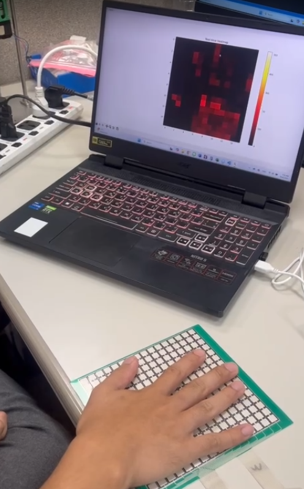

# Piezoresistive_Array_M1616_Serial_Reader

Python-based serial monitor for a **Piezoresistive Array M1616** sensor. This project receives real-time tactile data from the sensor over serial communication and displays it as a 16x16 pressure heatmap.

## Hardware
- [Piezoresistive Array M1616 Sensor](https://th.aliexpress.com/item/1005008874688367.html?gatewayAdapt=glo2tha)  
  *(Link to manufacturer page or relevant source)*
